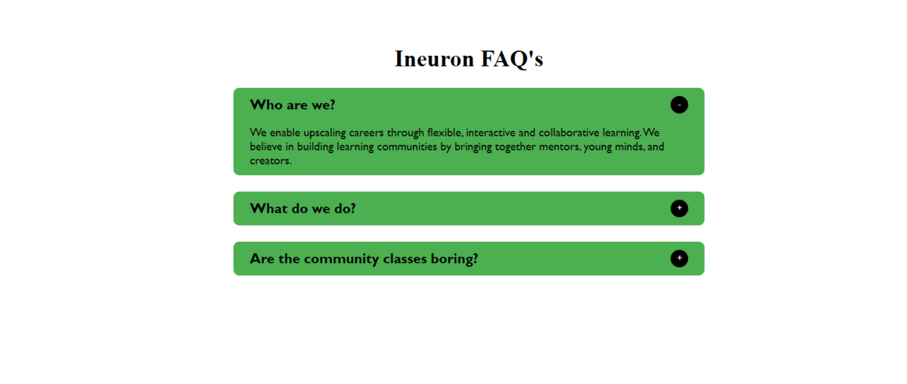

# Accordion FAQ

## 📌 Topics I learned while working on this project 📝

- `querySelector`
- `forEach` Method
- Learned about  `classList` & its properties `add()` & `remove()` to add and remove classes from elements
- `appendChild()`