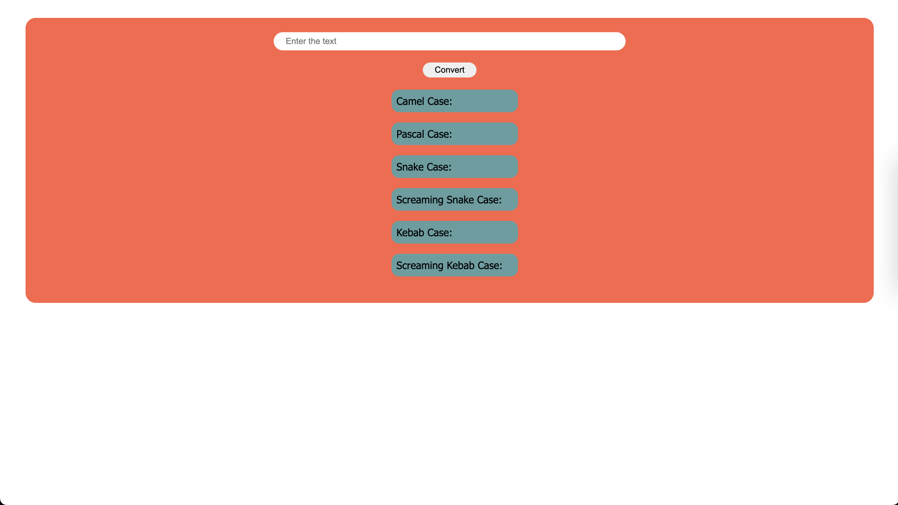

# Name Conversion 🔀

## 📌 **Project's Live Link 🚀 [Click here](https://nameconversionfsjs.netlify.app/)🔗**

### Screenshot

## 📌 Topics I learned while working on this project 📝

- Learned about Javascript Methods like
  - split() ➡ is used to split a string into an array of substrings based on a specified separator.
  - slice() ➡ is used to extract a part of a string and return a new string.
  - substring() ➡ is used to extract character at a specified index in a string
  - charAt() ➡ is used to return the charaterat the specified index in a string.
  - join() ➡ is used to join all elements of an array into a string, with each element separated by a specified separator.

---

