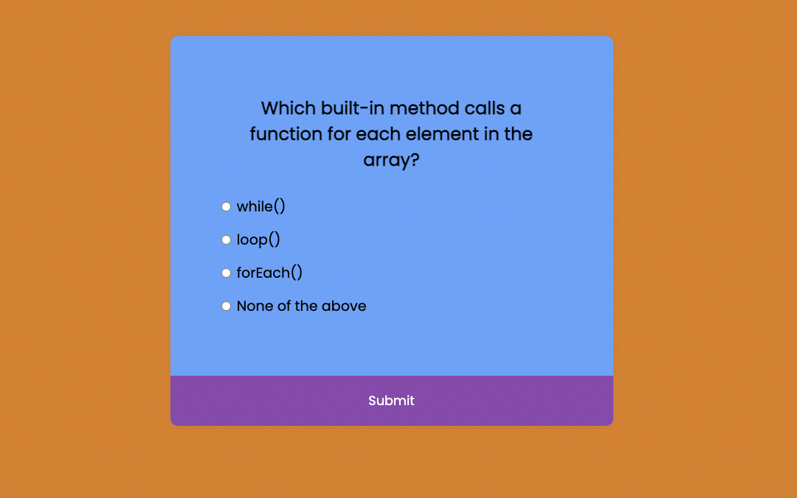

# 🤔 JavaScript QUIZ app ❔

## 📌 **Project's Live Link 🚀 [Click here](https://jsquizweb.netlify.app/)🔗**

> 👉 By [Arpit Pathak](https://github.com/arpit-pathak) 👨‍💻

### Screenshots :

_result page :_

## 📌 What I learned from this Project? 📝

- Learned about `addEventListener` and `forEach()` methods.
- Learned about `location.reload()` method to reload the current URL.
- Learned about `.checked` property used to return the checked status of an Input Radio Button.

## 📌 Time taken to finish this project ⏳

- 2.5 hours

---

